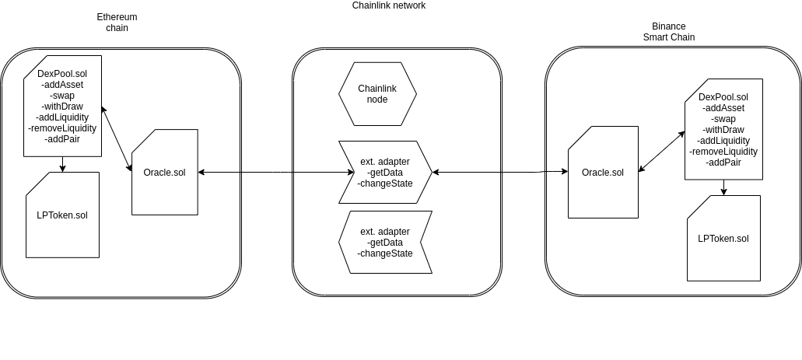

 

 
<a target='_blank' href = "https://digiu-lab.github.io/MarketMake/">DEMO</a>

# **Description**

The goal of our project is to create a **cross-chain*** swap between Ethereum and Binance Smart Chain (BSC) blockchains.
BSC is a functional clone of Ethereum, but much faster and has a ten times lower transaction cost than Ethereum. Now a DeFi ecosystem originates there.
Initially we wanted to create our own bridge between these blockchains, and we decided that we would use **Chainlink** for that.
The first idea that comes to mind is to issue our own peer tokens, secured by assets locked in another blockchain. But if you think about it for a bit, you realise that these tokens will be of little use to anyone and the idea of replacing them with more liquid assets arises.
In the BSC blockchain, the only liquidity entry point is Binance, the issuer of all traditional assets such as **ETH** or **USDT**. It issues its own so-called pegged tokens.
Therefore, if you have USDT ERC20 and want to place them at Binance Smart Chain, you have to transfer them to Binance and then send them to BSC. At that point, pegged-USDT tokens, secured by Binance's honest word, are issued to you. The opposite transactions are done in the same way.
We see this as a potential problem that we want to solve by allowing people to decentralise their assets between these blockchains. To do this, we plan to create a decentralised swap that uses liquidity pools in different blockchains and transmits cross-chain data using Chainlink-based bridging technology.

# **How It's Made**

This project uses Metamask and Binance Smart Wallet extensions to **simultaneously connect to Ethereum and BSC**.
It improves the user experience for working with our cross-chain swap, because the liquidity provider needs to have an opportunity to easily add and remove liquidity simultaneously across the two blockchains. This problem also arises in a regular swap.
You could of course do it step by step, like Binance Bridge, but let's be honest, it's not convenient)
The project architecture includes ChainLink and Binance nodes, smart contracts, and transactions signing and sending external adapters.
Besides, we use Uniswap technologies as the basis for decentralised swap. We will have to split the pool's smart contract logic between the two blockchains. We plan to do this separation with oracles on each blockchain side.

## Use cases
- User can swap any Ethereum asset to pegged BSC asset of same type
- User can swap a token of any type from Ethereum for any existing BSC token 
- Dexpool protocol can emit new BSC asset, the collateral is proved through Chainlink ETH-to-BTC integration

## Architecture

The prototype will include functionality
- add **ERC20**-like asset to DexPool of any configured chain
- make "pair" of two assets not depending to what chain each of them belong
- swap assets between chains with minimum rate calculations
- developed **chainlink external adapter script** is used to  get data from external chain and change state of another chain's smart contract 
- "bidirectional" wallet is implemented on front for better user experience

### DexPool contract
DexPool is deployed to both Ethereum and Binance Smart Chain networks. The methods like **swap, withdraw, addLiquidity** are implemented to be used from native chain as well as method **reciever** is used to be called from external chain through adapter.

## Architecture Diagram

